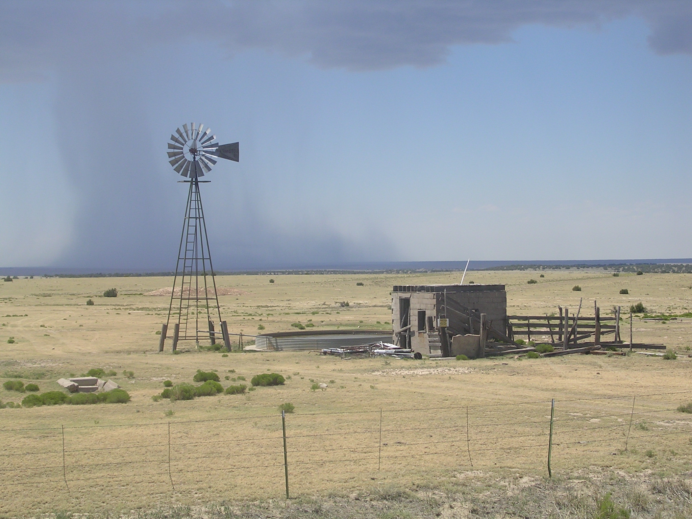

Welcome to TheDesignatedGeek Webpage
====================================

My name is Greg Walters and I am an author and amature photographer. This repository has been set up to support my writing.  I've been writing articles for [Full Circle Magazine](https://fullcirclemagazine.org/) since issue #27 back in July 2009. The current (at this writing) is issue #133 (May 2018). My articles are on Python programming and programming in the REAL world using Python.

I am currently working on my second book tenatively titled "Learning Page - A Python GUI Designer". Page, as the title suggests is a free Graphical User Interface Designer for Python using the Tkinter Toolkit. Page has been around many years and is currently at version 4.13. You can find Page [HERE](https://sourceforge.net/projects/page/) at https://sourceforge.net/projects/page/

Eventually, I plan to providing an index to all of my Full Circle Magazine articles as well as a link to the code for each article. That will take a while, though.  

